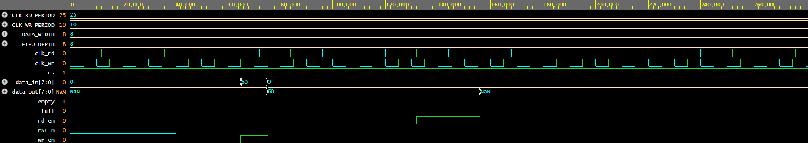

# Parameterized Asynchronous FIFO Buffer

## Overview
This repository contains the RTL implementation of an Asynchronous First-In, First-Out (FIFO) buffer. The design safely manages data transfer across two independent, unsynchronized clock domains (Read and Write). It acts as a robust data bridge between distinct hardware subsystems operating at different frequencies.

## Architecture & Components
The FIFO is built using a parameterizable, scalable architecture comprising the following core elements:
* **Memory Array:** The physical storage registers where data is held.
* **Write Pointer Engine:** Tracks the address for the next incoming data byte.
* **Read Pointer Engine:** Tracks the address for the next outgoing data byte.
* **Status Flags:** Combinational logic evaluating the capacity of the FIFO to prevent data overwrites or invalid reads.

## Interface Signals
The module relies on a standard control interface featuring configurable parameters for data width and FIFO depth:
* `cs`: Chip Select (Active high to enable FIFO operations)
* `wr_clk` / `rd_clk`: Independent clock signals for the write and read domains
* `wr_en`: Write Enable strobe
* `rd_en`: Read Enable strobe
* `data_in`: Parameterized input data bus
* `data_out`: Parameterized output data bus
* `full`: Asserts high when the memory array is at maximum capacity
* `empty`: Asserts high when there is no unread data in the array

## Operational Logic
Read and write operations occur completely independently of each other, synthesized across separate top-level modules to isolate the clock domains.

### Write Sequence
1. Driven by the asynchronous write clock.
2. Triggers when `cs` is high, `wr_en` is high, and the `full` flag is low.
3. Latches `data_in` into the memory array at the current Write Pointer address.
4. Increments the Write Pointer.

### Read Sequence
1. Driven by the asynchronous read clock.
2. Triggers when `cs` is high, `rd_en` is high, and the `empty` flag is low.
3. Drives the data from the current Read Pointer address onto the `data_out` bus.
4. Increments the Read Pointer.

### Flag Generation (N-bit + 1 Architecture)
To accurately calculate Full and Empty states, the read and write pointers utilize an extra Most Significant Bit (MSB). 
* **Empty Condition:** The FIFO is entirely empty when the Write Pointer and Read Pointer are perfectly identical across all bits (`wr_ptr == rd_ptr`).
* **Full Condition:** The FIFO is completely full when the Write Pointer has wrapped entirely around the memory array and caught up to the Read Pointer. This is evaluated by checking if the pointers match exactly, except for inverted MSBs (e.g., `rd_ptr == {~wr_ptr[MSB], wr_ptr[MSB-1:0]}`).

## Verification
The RTL was entirely verified utilizing **EDA Playground**. A comprehensive dual-clock testbench was written to simulate asynchronous reads and writes, proving the accurate assertion of the boundary flags and the stability of the data array across varying clock frequencies.

